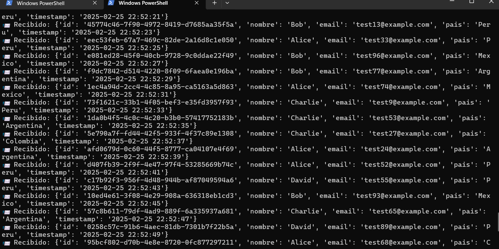

# Proyecto Kafka: Producer & Consumer

Este proyecto implementa un sistema de mensajería basado en Apache Kafka, compuesto por un **Producer** que envía mensajes eficientemente y un **Consumer** que los recibe correctamente.

## 📌 Requisitos

Antes de ejecutar el proyecto, asegúrate de tener instalado:

- **Docker & Docker Compose** (para ejecutar Kafka y Zookeeper)
- **Python 3.8+**
- **Librería kafka-python**
  ```bash
  pip install kafka-python
  ```

## 🚀 Configuración y Ejecución

### 1️⃣ Levantar Kafka con Docker
Ejecuta el siguiente comando en la raíz del proyecto para iniciar Kafka y Zookeeper:
```bash
docker-compose up -d
```

### 2️⃣ Ejecutar el Producer
El Producer envía mensajes a un tópico en Kafka.
```bash
python producer.py
```

### 3️⃣ Ejecutar el Consumer
El Consumer se suscribe al tópico y recibe mensajes en tiempo real.
```bash
python consumer.py
```

## 📂 Estructura del Proyecto
```
kafka-practice/
│── fotos/
│   └── recibidos.png  # Imagen de ejemplo de los mensajes recibidos
│── producer.py        # Código del productor de mensajes
│── consumer.py        # Código del consumidor de mensajes
│── docker-compose.yml # Configuración de Kafka y Zookeeper
│── README.md          # Documentación del proyecto
```

## 📸 Ejemplo de Mensajes Recibidos

A continuación, una muestra visual de los mensajes recibidos por el Consumer:



## 🛠️ Posibles Errores y Soluciones

1️⃣ **Error: NoBrokersAvailable**
   - Asegúrate de que Kafka está corriendo con `docker ps`
   - Verifica que el puerto `9092` esté correctamente mapeado en `docker-compose.yml`

2️⃣ **Error: ConnectionRefusedError**
   - Espera unos segundos después de iniciar Kafka para que el servicio esté completamente disponible.
   - Intenta reiniciar los contenedores con `docker-compose restart`

## 📌 Notas Finales

Este proyecto sirve como base para entender cómo funciona Apache Kafka en Python con Docker. Puedes expandirlo agregando procesamiento de datos en tiempo real o integrándolo con bases de datos.

💡 **¡Contribuciones y mejoras son bienvenidas!**

